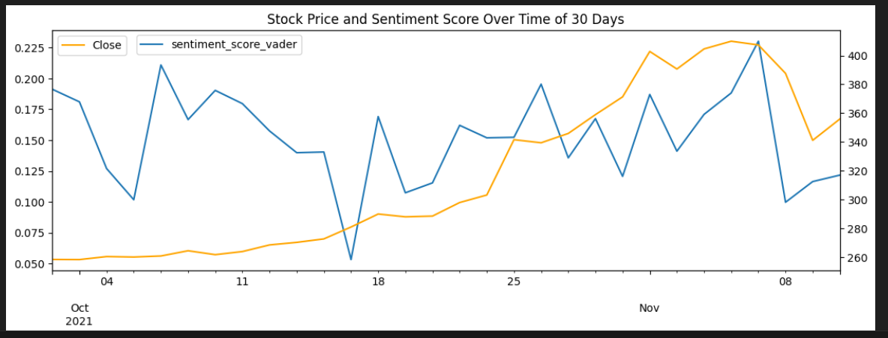

### Stock Market Price Prediction through Financial Sentiment Analysis. (Text Analysis)

#### Overview

This project aims to predict stock market prices by analyzing financial sentiment from stock-related tweets. It leverages Natural Language Processing (NLP) techniques for sentiment analysis and correlates sentiment scores with stock prices to enhance prediction accuracy. Classical Machine Learning (ML) models are then applied to forecast stock prices.

Dataset: https://www.kaggle.com/datasets/equinxx/stock-tweets-for-sentiment-analysis-and-prediction?select=stock_tweets.csv

#### Project Workflow

Visualization : EDA
1. Plotly Graph Objects – Analyze trading volume over time
2. Candlestick Chart – Examine stock price fluctuations
3. Area Chart – Study closing price trends

Data engineering: Preprocessing Stock Tweets
1. Removing unnecessary spaces, URLs, and special characters
2. Tokenization – Using word_tokenize from NLTK
3. Stopword Removal – Filtering out common, non-informative words
4. Lemmatization – Using SpaCy to normalize words

Sentiment Analysis
1. VADER (Valence Aware Dictionary for Sentiment Reasoning) – A rule-based sentiment analysis tool
2. Transformer Pipeline from Hugging Face – Leveraging deep learning for enhanced sentiment predictions

Correlating Sentiment Score with Stock Price

Classical Machine Learning Model: Price Prediction 

Feature Engineering
1. Moving Average
2. Bollinger Bands

Algos: 
1. Linear Regression
2. Ridge Regression
3. Random Forest 

#### Installation & Dependencies

pip install -r requirements.txt

#### Usage

Clone the repository:
git clone https://github.com/kalakhushi18/Capstone-Project.git

Install dependencies:
pip install -r requirements.txt

Run the Jupyter Notebook or Python script to:

Perform EDA and visualizations

Preprocess tweets for sentiment analysis

Train machine learning models for price prediction

